# hub

自动聚合 [@lzq1206](https://github.com/lzq1206) 及附加仓库的已部署网站地址、简介与预览。

截图图片存放在本仓库的 `screenshots/` 目录中（仅手动更新，不自动刷新）

_最后更新：2026-09-22 14:23 UTC_

## 网站列表

### [notam-whisper](https://rocket.rainywhisper.com/)

面向火箭发射观测的 NOTAM / MSI / NavWarnings 聚合器，会自动抓取、过滤并整理航空与航海通告，导出 CSV 和 KML 供地图与 Google Earth 查看，适合快速判断发射窗口附近的通告影响。

最近更新时间：2026-09-16 07:59 UTC

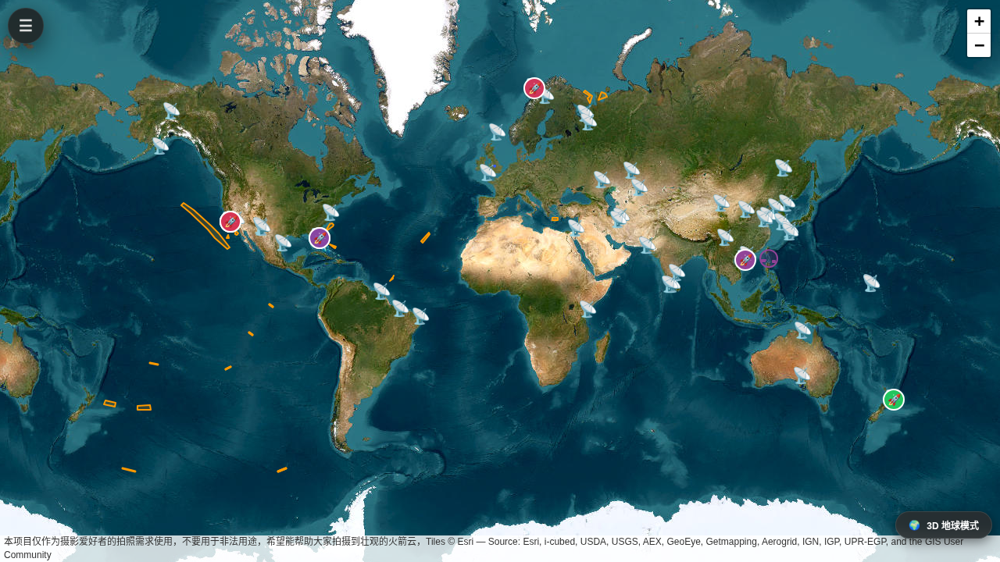

### [SubwayWhisper](https://subway.rainywhisper.com/)

通勤路线可达范围分析地图，可按出发点、时段和出行方式查看公交、骑行或驾车的真实路网边界。

最近更新时间：2026-09-22 14:16 UTC

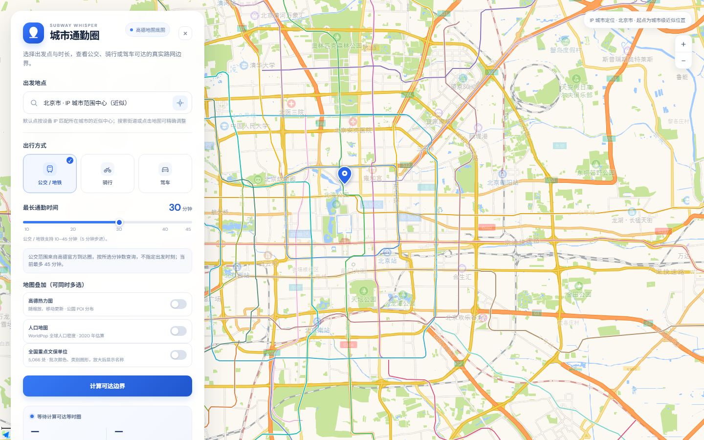

### [AIWeb](https://aiweb.rainywhisper.com/)

AI 小项目灵感库，聚合值得打开的开源工具、界面实验与 Vibe Coding 项目。

最近更新时间：2026-09-16 11:30 UTC

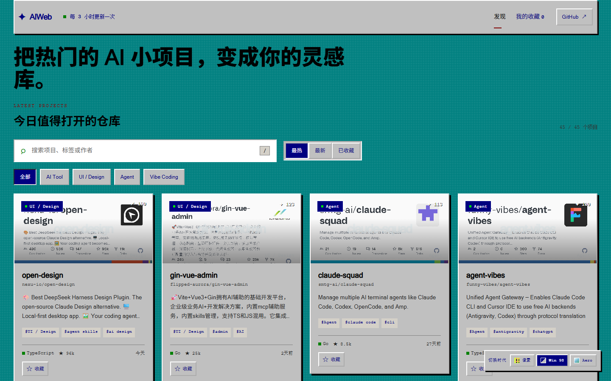

### [OrbitWhisper](https://orbit.rainywhisper.com/)

3D 在轨资产可视化与碰撞风险监控终端，围绕轨道卫星位置、动态风险和决策辅助展开，把高精度空间避碰分析做成可交互的网页面板。

最近更新时间：2026-09-16 10:47 UTC

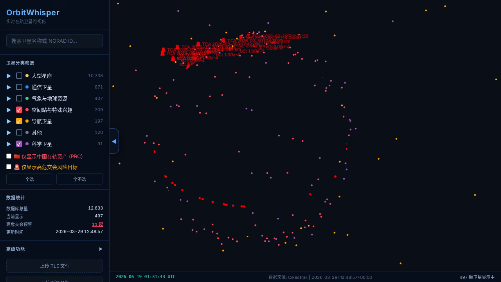

### [WeatherWhisper](https://climate.rainywhisper.com/)

面向中国主要城市的气候可视化站，采用 WeatherSpark 风格展示年内温度、降水、湿度、风、云量和旅游建议，并支持地图选站与月度细节浏览。

最近更新时间：2026-07-17 06:29 UTC

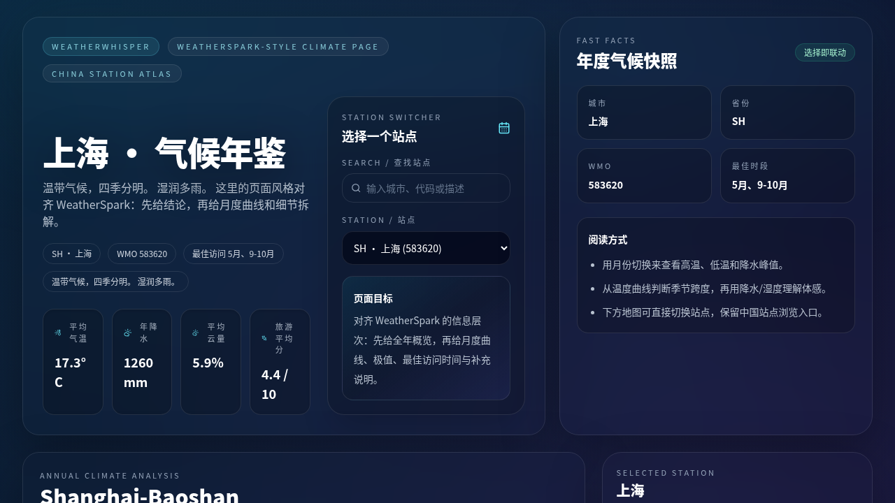

### [CulturalWhisper](https://cultural.rainywhisper.com/)

全国重点文物保护单位地图页，支持 KML / GeoJSON 导入、搜索、批次与省份筛选、点位详情查看和统计汇总，方便把文保名录快速落到地图上。

最近更新时间：2026-04-03 06:59 UTC

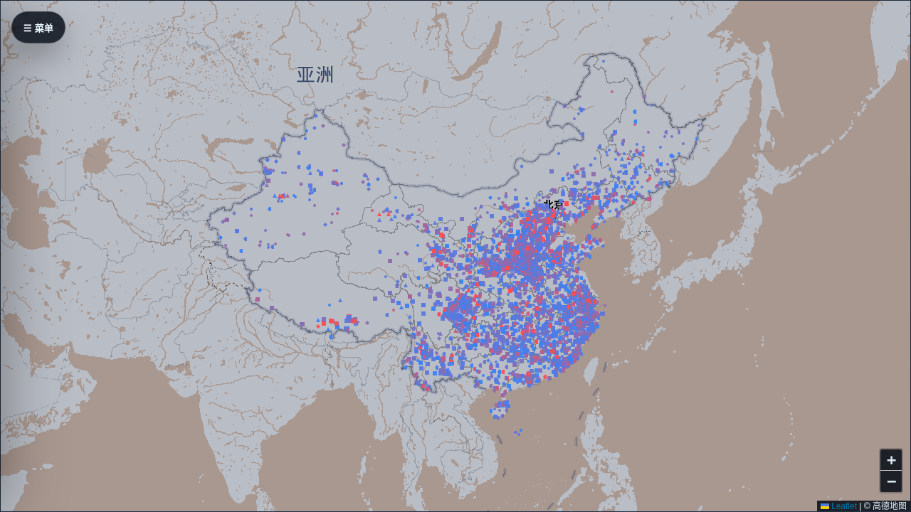

### [Poetry-Whisper](https://poetry.rainywhisper.com/)

古典诗词格律写作助手，围绕格律校验、词牌与意象提示提供交互式创作支持，帮助把灵感整理成更合乎传统韵律的诗词作品。

最近更新时间：2026-07-18 18:29 UTC

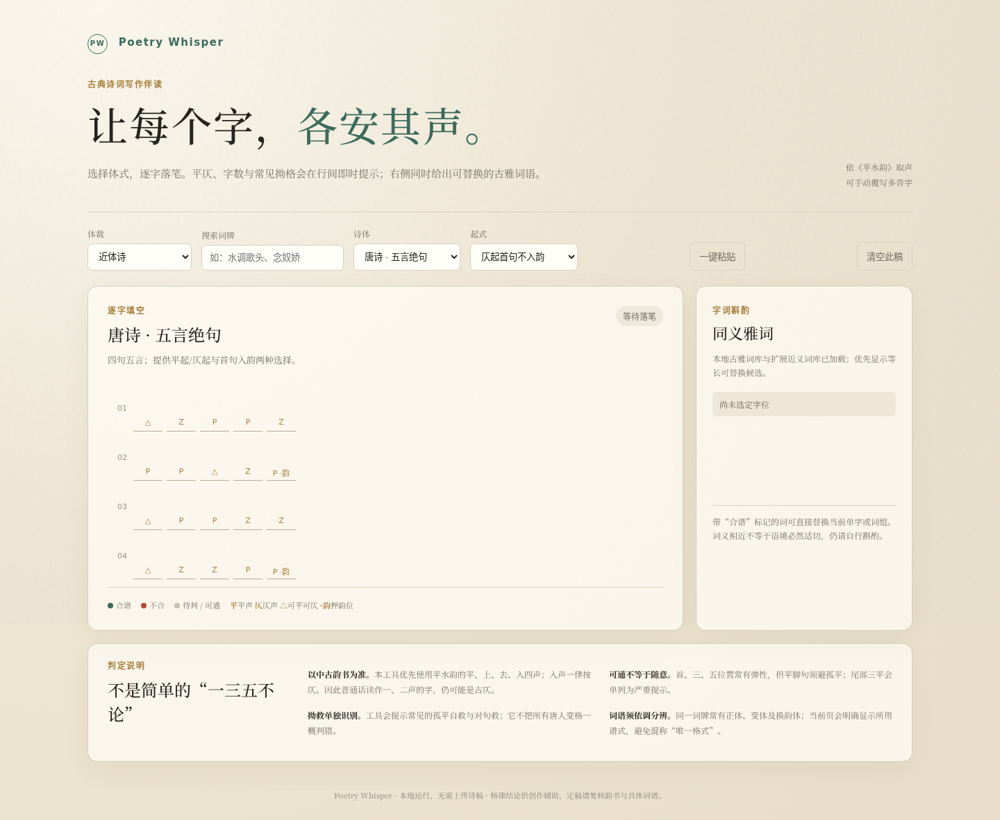

### [RetroWhisper](https://retro.rainywhisper.com/)

复古游戏、模拟器与像素工具目录，按复古主题整理值得保存的开源项目。

最近更新时间：2026-09-16 11:36 UTC

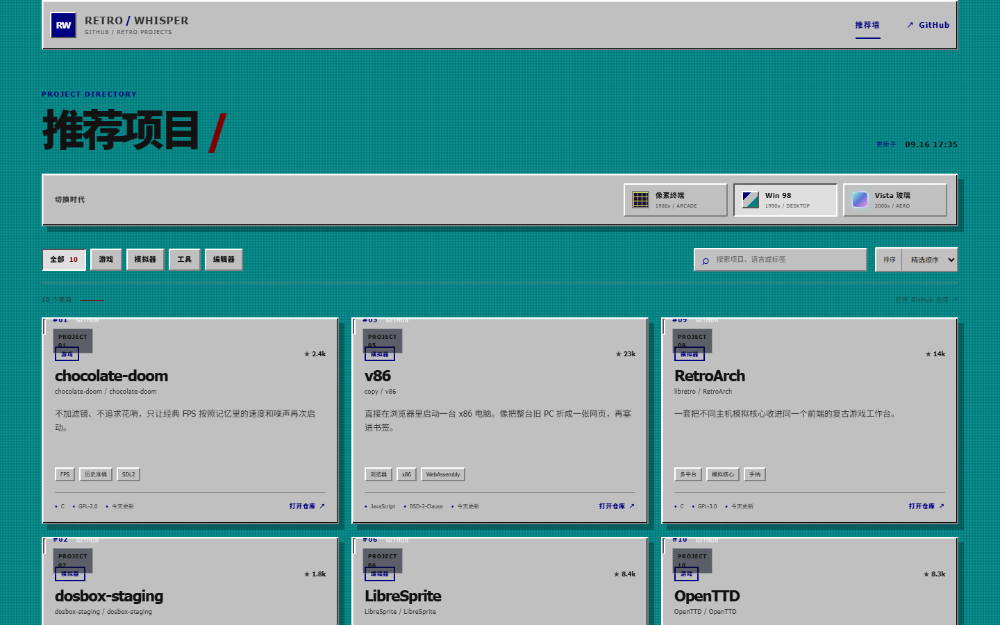

### [Milkyseas](https://milkyseas.rainywhisper.com/)

多地点荧光海预测与可视化站点，定时抓取海洋与天气预报，输出中国沿海/近海城市的高概率评分、趋势图和历史快照，帮助判断荧光海观测机会。

最近更新时间：2026-04-02 07:19 UTC

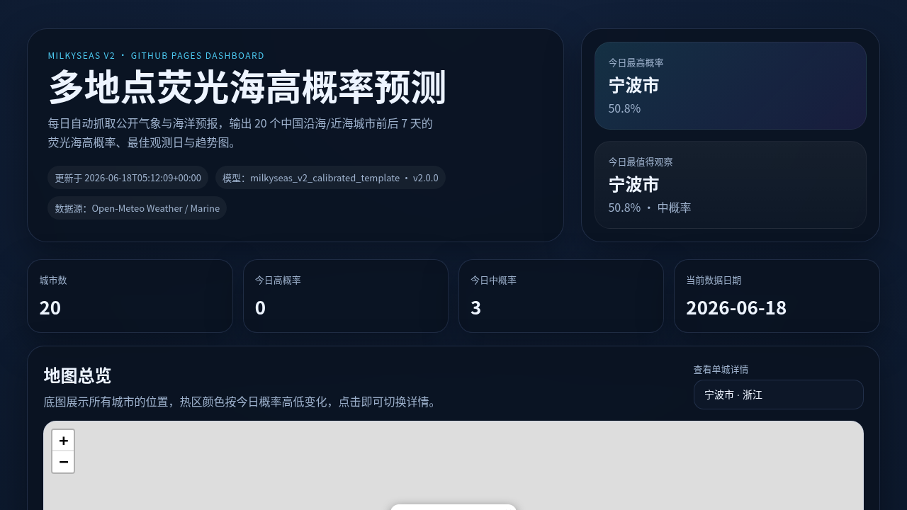

### [railwaystar](https://railwaystar.rainywhisper.com/)

中国高铁暗夜巡礼地图，面向高铁线路沿线的夜景与暗夜观测兴趣展示，适合用地图方式快速浏览线路与观测点。

最近更新时间：2026-06-15 02:53 UTC

### [MirageWhisper](https://mirage.rainywhisper.com/)

基于 GFS 分层温度数据的海市蜃楼与绿闪预报站，利用逆温层结构、云量和海温等信息评估未来多天的观测概率，并提供城市排行与热图展示。

最近更新时间：2026-06-15 02:55 UTC

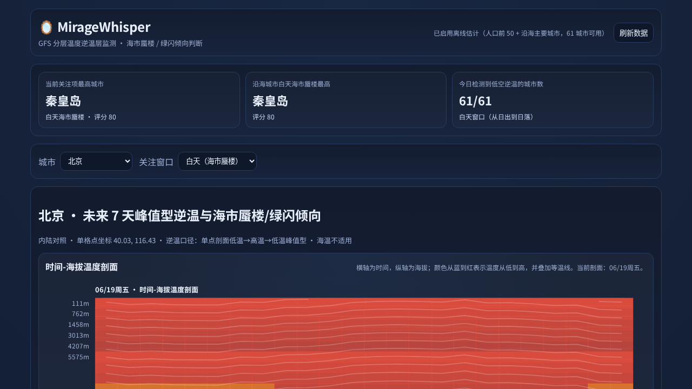

### [SunsetWhisper](https://sunset.rainywhisper.com/)

中国主要城市朝霞 / 晚霞预报页，基于分层云量、湿度、气溶胶与太阳路径判断观测机会，每日自动生成静态数据并部署到 GitHub Pages。

最近更新时间：2026-09-15 17:55 UTC

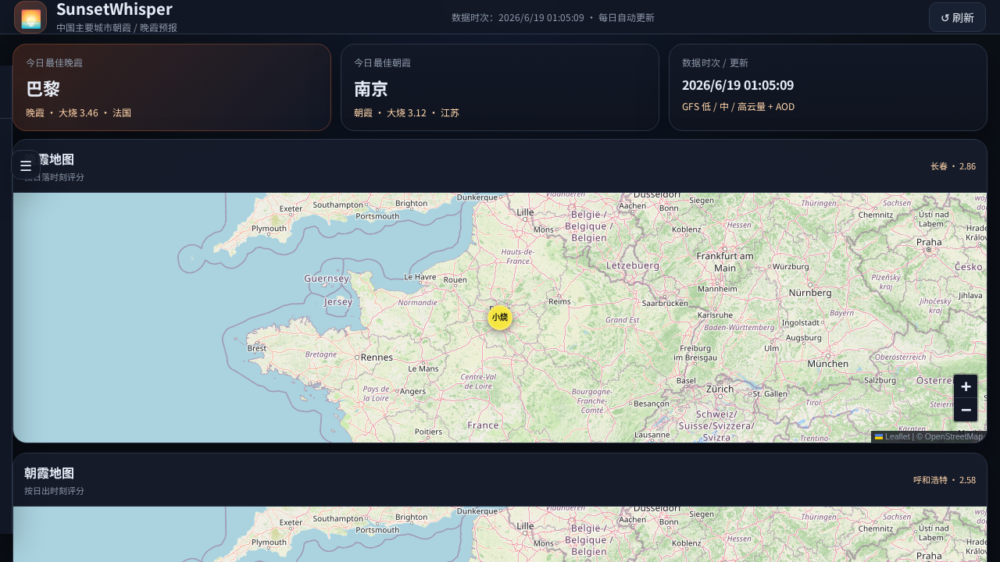

### [webwhisper](https://web.rainywhisper.com/)

可匿名发帖的演示站，带有算法调控后台和虚拟内容展示，适合作为 Web 产品演示、信息流实验或互动原型页面。

最近更新时间：2026-04-28 02:27 UTC

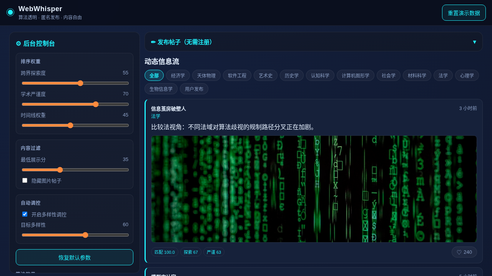

### [QuantWhisper](https://quant.rainywhisper.com/)

EXP-0004 虚拟组合看板，展示每日净值、基准对比、月度收益、持仓快照、最新调仓和比较指标，并支持 GitHub Actions 自动部署与 Telegram 汇报。

最近更新时间：2026-04-28 02:24 UTC

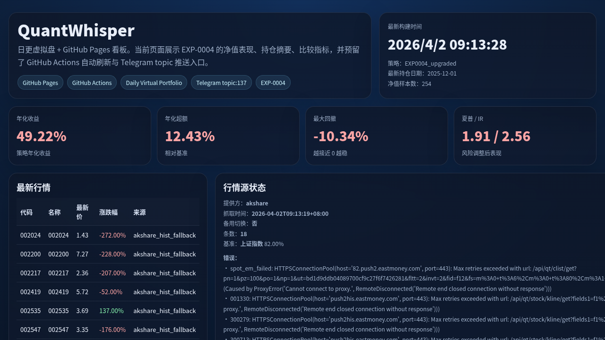
